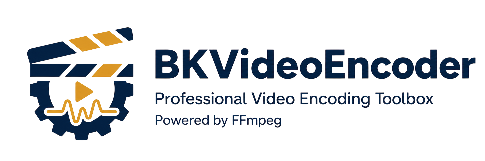
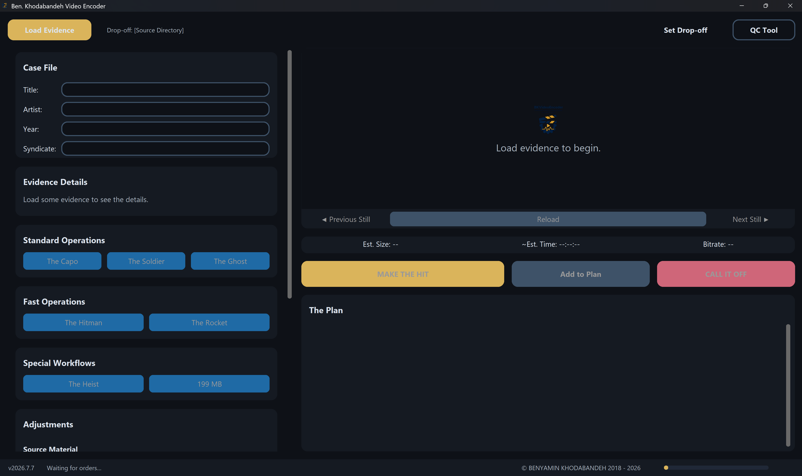
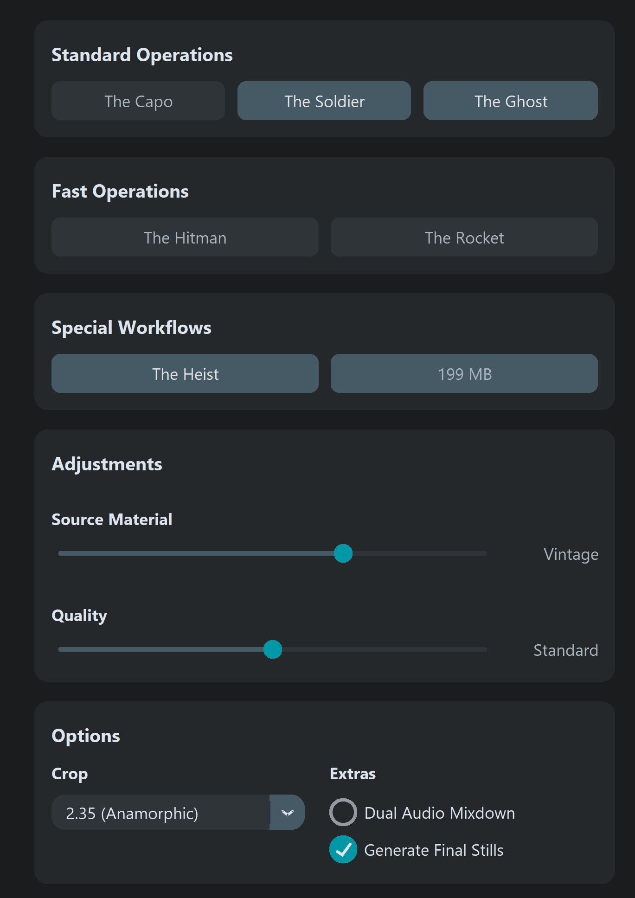
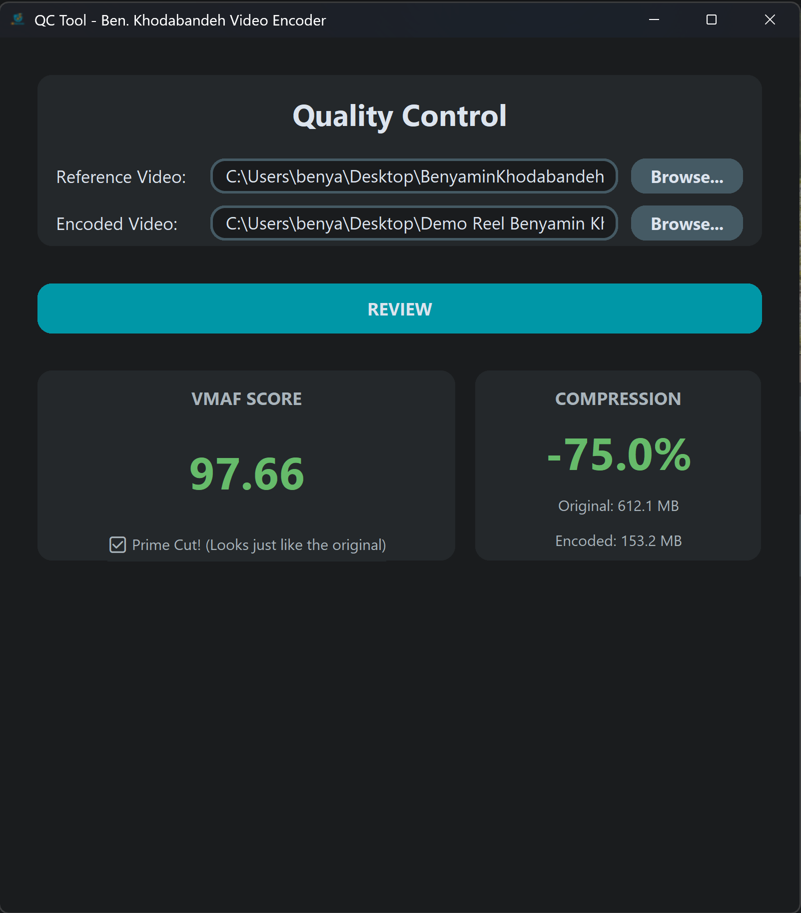

# Ben. Khodabandeh Video Encoder

**A professional video encoding toolbox powered by FFmpeg.**  
Wrap x264, x265, and aac into preset-based workflows — no CLI gymnastics.

  

<p align="center">
  
</p>

## Screenshots

<p align="center">
  
</p>
<p align="center">
  
  
</p>

---

## Features

- **Preset-driven encoding** — pick from curated presets (The Capo, The Soldier, The Ghost, The Hitman, The Rocket, The Heist, The Job) or mix and match
- **Source-aware tuning** — adjusts encoder params for clean, modern, vintage, or animation source material
- **Three quality levels** — Lean, Standard, Prime Cut
- **Batch queue** — stack jobs with different presets and process them in one run
- **VMAF QC Tool** — compare original vs. encoded with perceptual quality scoring
- **Preview stills** — auto-generated snapshots with dominant-color palette bars
- **Metadata tagging** — embed title, artist, year, syndicate into output files
- **Audio mixdown** — dual-track: original multichannel + stereo downmix
- **Scene detection** — via PySceneDetect or FFmpeg
- **Crop detection** — auto-detect letterbox/pillarbox or choose from common aspect ratios

---

## Quick Start

### Download

Grab the latest portable archive for your platform from the [Releases page](https://github.com/benkhodabandeh/BKVideoEncoder/releases).

- **Windows**: `BKVideoEncoder.*.windows.7z` → extract and run `BKVideoEncoder.exe`
- **Linux**: `BKVideoEncoder.*.linux.7z` → extract and run `./BKVideoEncoder`
- **macOS**: `BKVideoEncoder.*.macos.7z` → extract and run `./BKVideoEncoder`

No installation required. The FFmpeg binary is bundled.

### Build from Source

```bash
git clone https://github.com/benkhodabandeh/BKVideoEncoder.git
cd BKVideoEncoder
pip install -r requirements.txt pyinstaller

# On Windows:
python build.py

# On Linux/macOS:
python build.py
```

The built binary + FFmpeg bundle lands in `dist/`.

---

## How It Works

1. **Load a video** — sets the source.
2. **Enter metadata** — title, year, artist (used for filenames and output folders).
3. **Select preset(s)** — each preset targets a specific encoder/resolution/workflow.
4. **Adjust quality** — Lean (smaller), Standard (balanced), Prime Cut (highest).
5. **Queue or Go** — add multiple jobs to The Plan or hit MAKE THE HIT.

---

## Preset Reference

### Standard Operations

| Preset | Codec | Mode | Use Case |
|--------|-------|------|----------|
| **The Capo** | x264 | CRF | High-quality master, good compatibility |
| **The Soldier** | x264 | 2-pass ABR | Web distribution, max x264 quality |
| **The Ghost** | x265 | 2-pass ABR | Maximum compression, 10-bit depth |

### Fast Operations

| Preset | Codec | Mode | Use Case |
|--------|-------|------|----------|
| **The Hitman** | x264 | CRF | Quick x264 encode |
| **The Rocket** | x265 | CRF | Quick x265 encode |

### Special Workflows

| Preset | Codec | Mode | Use Case |
|--------|-------|------|----------|
| **The Heist** | x264 | 2-pass ABR | Vertical 1080p (social media) |
| **The Job** | x264 | 2-pass ABR | Target-file-size encode |

---

## Audio Codec Fallback

The presets prefer **libfdk-aac** (higher quality). If your FFmpeg build doesn't include
it (e.g., the CI-provided builds from BtbN), the app automatically falls back to
FFmpeg's native `aac` encoder. No manual configuration needed.

---

## Third-Party Components

This project bundles or depends on several open-source components. See
[licenses/ACKNOWLEDGMENTS.md](licenses/ACKNOWLEDGMENTS.md) for the full list with
license details and home pages.

---

## License

The Ben. Khodabandeh Video Encoder source code is licensed under the **GNU General Public License v3**.
See [LICENSE](LICENSE) for the full text.

Bundled FFmpeg builds are provided under their own terms (LGPL/GPL + non-free
for libfdk-aac). See the `licenses/` directory for details.

---

## Author

**Benyamin Khodabandeh** — Director, cinematographer, and the mind behind this encoder.  
© 2018–2026

**Find me online**  
[Website](https://benyaminkhodabandeh.ir/) · [Instagram](https://instagram.com/benilorn) · [FilmFreeway](https://filmfreeway.com/benyaminkhodabandeh) · [Letterboxd](https://letterboxd.com/benartic/) · [IMDb](https://www.imdb.com/name/nm10390589/) · [Email](mailto:benyaminkhodabandeh@icloud.com)
